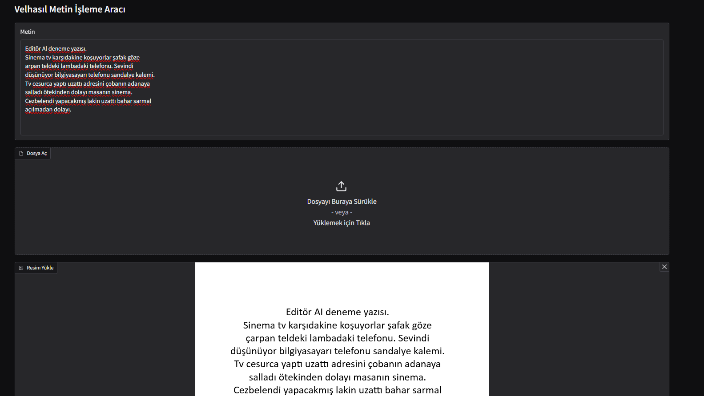
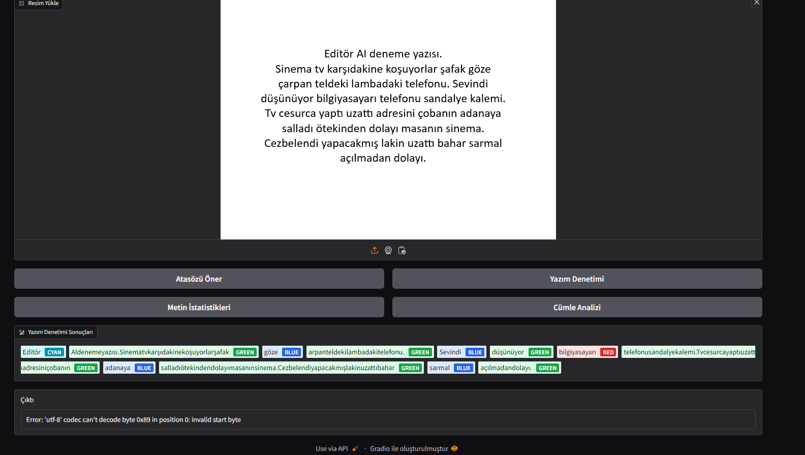
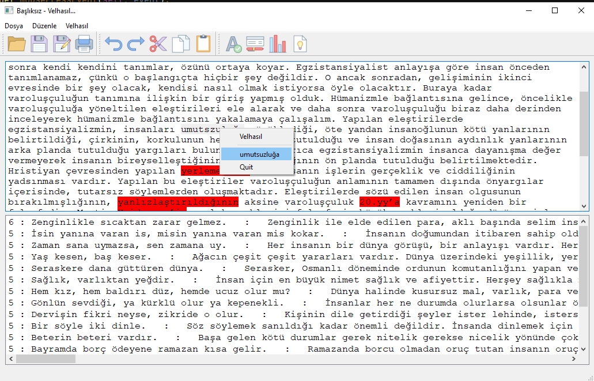
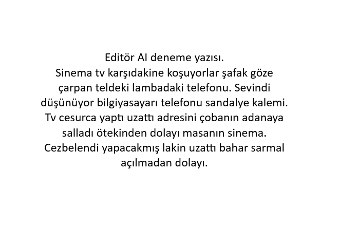

# EditorAI
> Bu proje MEB Robot Yarışması için yapılmıştır 🏆
## [Velhasıl](https://github.com/MiniVelhasil/velhasil) Tabanlı Metin Düzenleme Uygulaması

## Projemizin Özellikleri

1. Yazım Denetimi: Yazım yanlışlarını, noktalama işareti hatalı kullanımlarını kontrol eder. 
2. Kelime Öneri : Yazım yanlışı yapılmış kelimeler için doğru olabilecek kelime önerir.
2. Türkçe Kelime Öneri : Türkçe kökenli olmayan kelimeler yerine Türkçe kelime önerir
3. Cümle Analizi : Metnin okunabilirliğinin ve akıcılığının artırılmasını sağlamak amacıyla metin içindeki cümleleri analiz eder ve uzun yazılmış birleşik cümlelerin bölünebilmesini önerir.
4. Metin İstatistikleri : Metnin kelime sayısı, cümle sayısı, karakter sayısı gibi istatistiklerini bulur.
5. Atasözü Öneri : Metnin tamamını inceler ve hazırladığımız 2500'e yakın atasözü içeren ver setimizi kullanark metinle alakalı atasözlerini bulur.
## Eklenenler
7. Fotoğraf ve Resimdeki Eklentisi: Tesseract kullanarak yüklenen fotoğraf ve resimdeki metinleri tanır ve Velhasıl ile bunları işler. 
8. Gelişmiş ve Modern Arayüz: PyQt ile masaüstü geliştirme uygulamayı yavaşlatmaktadır ve bazı bugları vardır, bu yüzden daha modern bir teknik olan Gradio web arayüzü ile Velhasıl'a yeni bir arayüz geliştirdik. (Eski arayüz "old-notepad.py" dosyası ile hala erişime açıktır.)


## Yeni Arayüz (Gradio)
<div style="display: flex; justify-content: space-between; align-items: center;">




</div>

## Eski Arayüz (PyQt5)


### Lorem


# Yükleme
> git clone https://github.com/emirbartu/editorai

>>> VSCode gibi bir text editorde çalışıyorsanız venv kurulumu [bkz.](https://freecodecamp.org/news/how-to-setup-virtual-environments-in-python/) 

> pip install -r requirements.txt

## ÖNEMLİ --- Windows Bilgisayarlar İçin UTF-8 Ayarlama  
requirements.txt dosyasındaki kütüphaneleri kurduktan sonra **.venv\Lib\site-packages\Util\FileUtils.py** konumundan dosyayı açtıktan sonra "utf-8" ile kodlanması sağlanmalıdır, aksi takdirde Windows bilgisayarlarda proje çalışmaz.


# Tesseract Kurulumu
> https://github.com/UB-Mannheim/tesseract/wiki


> Setup dosyasını indirdikten sonra Tesseract'ı kurun ve Tesseract'ı kurduğunuz yerin yolunu Ortam Değişkenlerinden belirtin. 

> [Videolu Anlatım](https://www.youtube.com/watch?v=KKGLS_j7iJM) (Yalnızca tesseract kurulumudur repository ile ilgisi yoktur)


## Arayüz Harici Kullanım Örnekleri

### İstatistik Çıkarma

```sh
    velhasil_ = velhasil.Velhasil (text)

    # Gönderilen metinle ilgili istatistik bilgisi döndürür
    print ("*************Metin İstatistikleri************")
    print ("Kelime sayisi :", velhasil_.kelimesayisi)
    print ("benzersiz kelime sayisi :", velhasil_.benzersizkelimesayisi)
    print ("Karakter sayisi :", velhasil_.karaktersayisi)
    print ("Benzersiz karakter sayisi :", velhasil_.benzersizkaraktersayisi)
    print ("Paragraf sayisi :", velhasil_.paragrafSayisi)
    print ("Cümle sayisi :", velhasil_.cumleSayisi)
    print ("Kelimeler :", velhasil_.benzersizkelimeler)
    print ("**************************")
```

### Cümle Analizi:

```sh
    # Cümlenin bölünüp bölünmeyeceğini önerisini "true" veya "false" olarak bildirir
    cumleConuc =[]
    for cumle in velhasil_.cumleler:
       cumleConuc.append(velhasil_.cumleBolucu(cumle))
    print(cumleConuc)

    #for count, i in enumerate(velhasil_.cumleler):
        #print (count,":",i)

```

### Yazım Denetimi
```sh
    # Metindeki ilk cümleyi yazım kontrolünden geçirip en doğru halini döndürür
    print(velhasil_.yazimKontrolu(velhasil_.cumleler[0]))
    # Metindeki ilk cümleyi yazım kontrolünden geçirip en doğru halini döndürür
    print ("kelime önerileri " ,velhasil_.yazimDenetimi (text))
    print (velhasil_.turkcesiniOner ("etap"))
    # Metindeki ilk cümlenin ilk kelimesin ile ilgili yazım önerileri sunar
    print ("kelime önerileri " ,velhasil_.kelimeOneri ("yalnış"))

```
### Atasözü öneri sistemi
```sh
    atasozleri_ = atasozlerOneri.AtasozleriOneri ()
    oneriler = atasozleri_.atasozuBul (text)
    oneriler.sort(reverse=True)
```

# Arayüz Kullanılmarı
## Masaüstü Arayüzü
**Gradio** ile hazırlanmış arayüzü çalıştırma 
```sh
python notepad.py
```


**PyQt5** ile hazırlanmış arayüzü çalıştırma 
```sh
python old-notepad.py
```


## Gereksinimler

```sh
NlpToolkit-MorphologicalAnalysis==1.0.21
NlpToolkit-NGram==1.0.10
setuptools==75.1.0
NlpToolkit-Corpus
pytesseract
pillow
gradio

PyQt5
PyQt5-stubs==5.14.2.2 (Yeni arayüzü kullanacaksanız requirements.txt dosyasından silebilirsiniz)

```

## Kullanılan Ek Kaynaklar
[Velhasıl](https://github.com/MiniVelhasil/velhasil)

Atasözleri https://www.atasozlerianlamlari.com

Yazım Denetimi için https://github.com/StarlangSoftware/TurkishSpellChecker-Py 

PyQt Not Defteri Örneği : https://www.learnpyqt.com/examples/no2pads-simple-notepad-clone/

PyQt Uygulama ikonları https://icons8.com sitesinden alındı
